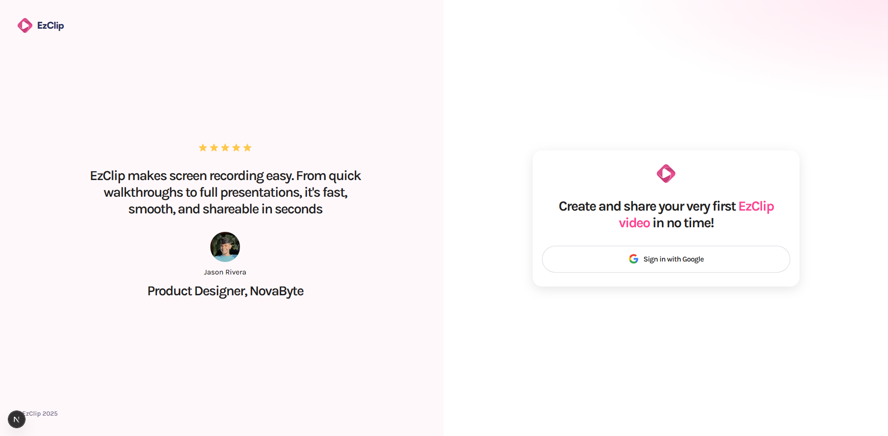
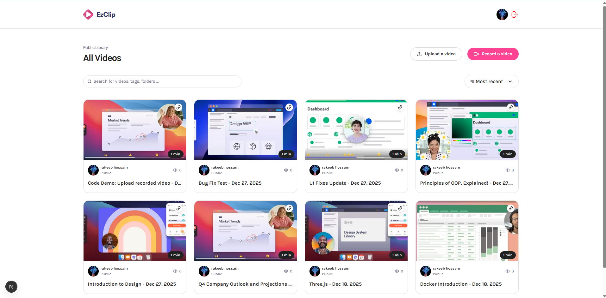
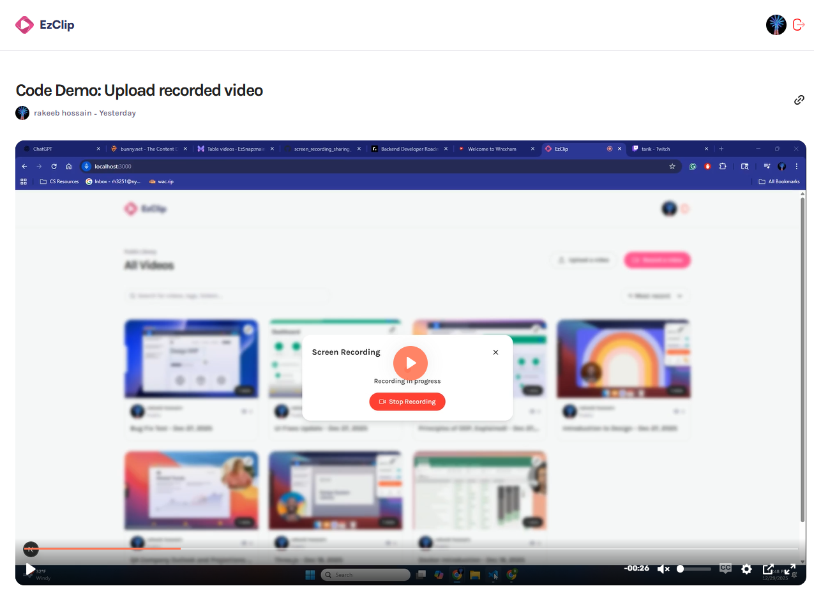
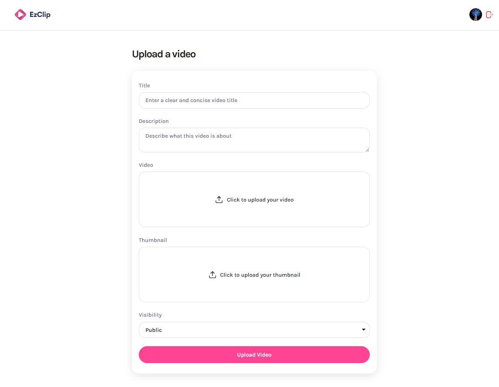
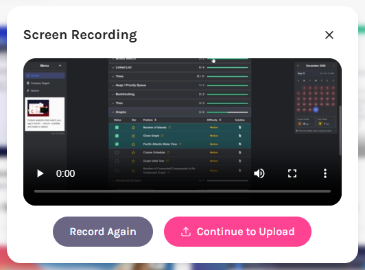

# EzClip

EzClip is a **production-ready Next.js application**. It enables users to **record, store, and share video clips seamlessly** under one platform, with a strong emphasis on scalability, security, and clean architecture.

**EzClip showcases:**

* Full‑stack development with Next.js App Router
* Secure authentication and authorization flows
* Cloud-based video storage and delivery
* Type-safe database access and server actions
* Client-side media APIs and custom React hooks

---
## 🔗 Demo
[🔗 Vercel Demo Link](https://ez-clip.vercel.app/)

<table align="center">
  <tr>
    <td align="center">
      <br/>
      <strong>Login Page</strong>
    </td>
    <td align="center">
      <br/>
      <strong>Home Page</strong>
    </td>
  </tr>

  <tr>
    <td align="center">
      <br/>
      <strong>Video Details Page</strong>
    </td>
    <td align="center">
      <br/>
      <strong>Upload Video Page</strong>
    </td>
  </tr>

  <tr>
    <td align="center" colspan="2">
      <br/>
      <strong>Screen Record UI</strong>
    </td>
  </tr>
</table>

## ✨ Features

* 🎥 **In-browser screen & video recording**
* ☁️ **Scalable video storage & delivery** using Bunny.net
* 🧠 **AI-generated video transcripts, title and dscription** powered by Bunny.net
* 🔐 **Secure authentication** with better-auth
* 🛡️ **Application-level protection** via Arcjet
* 🗄️ **Type-safe database access** using Drizzle ORM with Xata
* 📤 **Video & thumbnail uploads** via API routes
* ⚡ **Next.js App Router** architecture
* 🧩 **Reusable, modular UI components**

---

## 🧱 Tech Stack

### Frontend

* **Next.js (App Router)**
* **TypeScript**
* **React**
* **CSS Modules**

### Backend & Infrastructure

* **Bunny.net** – video storage & streaming
* **Arcjet** – security, rate limiting, and bot protection
* **better-auth** – authentication & session management
* **Xata** – serverless database
* **Drizzle ORM** – type-safe SQL queries

---

## 📁 Project Structure

```
app/
├─ (auth)/              # Auth-related routes
├─ (root)/              # Main application routes
│  ├─ profile/[id]/     # User profile page
│  ├─ upload/           # Video upload form page
│  ├─ video/[videoId]/  # Video details page
│  ├─ layout.tsx        
│  └─ page.tsx          # Main Page
├─ api/
│  ├─ auth/             # Authentication API routes
│  ├─ upload-thumbnail/ # Thumbnail upload endpoint
│  └─ upload-video/     # Video upload endpoint
├─ globals.css          # Global styles
└─ layout.tsx           # Root layout

components/             # Reusable UI components
constants/              # App-wide constants
drizzle/                # Drizzle ORM schema & config
fonts/                  # Custom fonts

lib/                    # Core Application Logic
├─ actions/
│  └─ video.ts          # Server actions for videos
├─ hooks/
│  ├─ useFileInput.ts
│  └─ useScreenRecording.ts
├─ arcjet.ts             # Arcjet configuration
├─ auth-clients.ts       # Better-Auth client setup
├─ auth.ts               # Better-Auth server setup
└─ utils.ts              # Shared utilities

proxy.ts                 # Middleware
xata.ts                  # Xata DB Client
```

---

## 🔐 Authentication

EzClip uses **better-auth** to implement a secure, extensible authentication system suitable for production applications.

### Supported Auth Features

* Email / session-based authentication
* OAuth (Google)
* Auth-protected routes and server actions
* Secure session handling

Auth-related logic is organized for clarity and maintainability:

```
app/api/auth/
lib/auth.ts
lib/auth-clients.ts
```

### Google OAuth Setup (better-auth)

To enable Google sign-in via **better-auth**, configure a Google Cloud project.

#### 1. Create a Google Cloud Project

* Open the Google Cloud Console
* Create or select a project

#### 2. Configure OAuth Consent Screen

* Go to **APIs & Services → OAuth consent screen**
* Select **External**
* Provide app name, support email, and authorized domains

#### 3. Create OAuth Client ID

* Navigate to **APIs & Services → Credentials**
* Create **OAuth Client ID** (Web application)
* Add Authorized JavaScript Origins & Redirect URIs:

```
http://localhost:3000/api/auth/callback/google
your-production-domain/api/auth/callback/google
```

#### 4. Enable Google People API
* Search *Google People API*
* Click Enable

#### 5. Environment Variables

```env
GOOGLE_CLIENT_ID=your_google_client_id
GOOGLE_CLIENT_SECRET=your_google_client_secret
```

These values are consumed by **better-auth** during provider initialization.

---

## 🛡️ Security

Security is handled using **Arcjet**, providing:

* Rate limiting
* Bot protection
* Abuse prevention

Arcjet configuration can be found in:

```
lib/arcjet.ts
```

---

## 🎥 Video Storage & Uploads

* Videos and thumbnails are uploaded via **Next.js API routes**
* Files are stored and streamed through **Bunny.net** for speed and scalability

Relevant API routes:

```
app/api/upload-video/route.ts
app/api/upload-thumbnail/route.ts
```

---

## 🗄️ Database

EzClip uses **Xata** as the database with **Drizzle ORM** for type-safe access.

* Schema & migrations live in `drizzle/`
* Queries and mutations are handled via server actions in `lib/actions/`

---

## 🧠 Hooks

Custom React hooks encapsulate complex client-side logic:

* `useScreenRecording` – screen & media recording
* `useFileInput` – file selection and validation

Located in:

```
lib/hooks/
```

---

## 🚀 Getting Started

### 1. Clone the repository

```bash
git clone https://github.com/your-username/ezclip.git
cd ezclip
```

### 2. Install dependencies

```bash
npm install
```

### 3. Configure environment variables

Create a `.env` file and add:

```env
# Base URL
NEXT_PUBLIC_BASE_URL=

# BetterAuth
BETTER_AUTH_SECRET=
BETTER_AUTH_URL=         # Base URL of your app

# Google
GOOGLE_CLIENT_ID=
GOOGLE_CLIENT_SECRET=

# XATA
XATA_API_KEY=
DATABASE_URL_POSTGRES=

# Bunny
BUNNY_STORAGE_ACCESS_KEY=
BUNNY_LIBRARY_ID=
BUNNY_STREAM_ACCESS_KEY=

# Arcjet
ARCJET_API_KEY=
```

### 4. Run the development server

```bash
npm run dev
```

Visit: `http://localhost:3000`

---

## 📦 Deployment

EzClip can be deployed on platforms like **Vercel** or **Node-based hosts**.

Make sure to:

* Configure all environment variables
* Enable Edge / Serverless functions if required

---

## 🛠️ Future Improvements

* Video analytics
* Comments & reactions
* Folder-based organization
* AWS Based Backend

---

## 🙌 Acknowledgements

* Next.js
* Bunny.net
* Arcjet
* better-auth
* Xata
* Drizzle ORM

---

**EzClip** – Record. Store. Share. Effortlessly.


